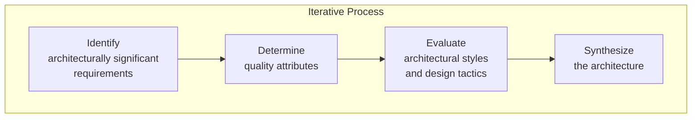
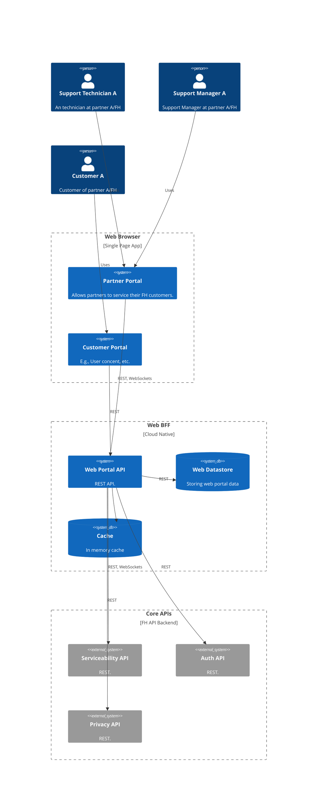
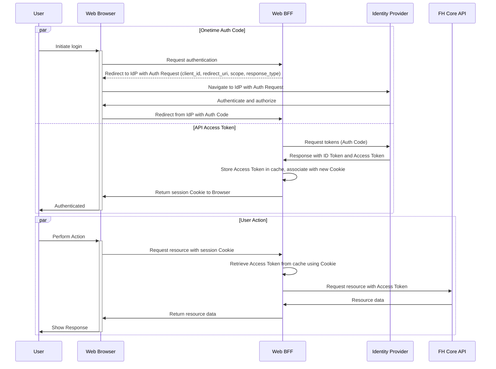
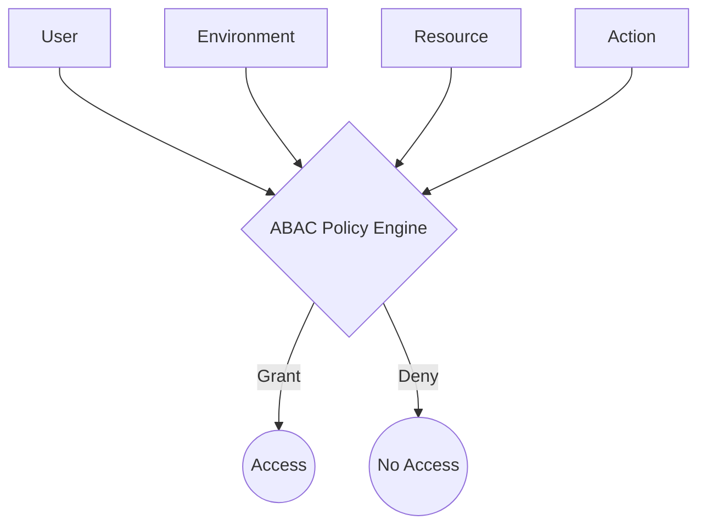

# Architecture Overview

## Introduction

This document outlines the software design for the Serviceability Web Frontend Application intended for X's implementing partners. It serves as a blueprint for development and implementation. Here we present our thought process, options, rationales behind our recommendations so that we can make informed decisions about the construction of the best suitable architecture for the problem at hand.

## Architecture Process

This initial step focuses on identifying requirements that have a substantial impact on the software's architecture. ASRs typically include functional requirements that are critical for the system's operation and non-functional requirements related to performance, security, maintainability, and scalability.  

Once ASRs are identified, the next step is to define the quality attributes that the architecture should support (like performance, reliability, usability, and security). Each attribute must be well-defined, possibly quantified, and prioritized.

With quality attributes available, architects evaluate architectural tactics that can be used to achieve them. For example, to enhance performance, tactics might include introducing caching or load balancing.  

Combining the identified tactics, the architecture will be derived. This involves creating models and diagrams that explain components, their interactions, and how they are deployed.

The derived architecture is a live artifact that is iteratively refined and validated against the requirements. This may involve prototyping, testing, or analytical methods to ensure the architecture can meet the requirements.

## System Context

Below is a system context diagram depicting the interaction between the web frontend, Serviceability API, and other system components.

## Techstack

### Hosting Environment

We recommend AWS Cloud due to FH existing infrastructure and know-how.

### Frontend UI Framework

Options:

- React JS
- Vue JS
- Meta Framework such as Nextjs/Nuxtjs

### Backend for Frontend (BFF)

It is proposed to keep the BFFs light and deployable to cloud serverless environments. This will optimize the cost of maintenance while providing fault tolerance and scalability.

Options:

- CloudNative Handlers (Fully managed, etc.)
  - GraphQL API (e.g., AppSync), Serverless Functions, Websockets
  - API Gateway, Serverless Functions, Websockets
- Backend scripts written in serverless mode (Less vendor locking, Better DX, etc.)
  - E.g., Nextjs APIs deployed to AWS Lambda

### DevOps Pipeline

- GitHub Actions
- AWS SAM
- Infrastructure as code (Serverless Framework of Pulumi?) 

### Identity Provider

- AWS Cognito with MFA

### Testing

- Cypress for teasing Components, E2E, API

## Security and Privacy

### Authentication

The OAuth 2.0 specification defines two different client types, public and confidential clients.
Here we recommend implementing a confidential client that can store secrets on the backend.

Diagram: Simplified diagram of OpenIDConnect Hybrid Flow

### Authorization

Authorization APIs will probably use Attribute-Based Access Control (ABAC) behind the API (ASSUMPTION).  ABAC is a system that determines user access based on multiple attributes rather than roles or specific user identity. Such attributes include  User-Groups, ACLs, Roles, Action, Resource, etc. ABAC allows the implementation of granular, policy-based access control, using different combinations of attributes to create conditions of access that are as specific or broad as the situation calls for.

Note: This implementation may be out of scope from the web project and be implemented within core APIs

### Web Security

Recommended practices are listed below

- Minimize API token exposure (hide in BFF)
- Secure cookies
  - Secure
  - httponly
  - samesite
  - set expiry
  - limited domain scope
  - no privacy info added
- Implement data input validation (zero trust in external inputs)
- Use Content Security Policy (CSP) headers
- Secure sessions (unpredictable IDs, proper logout, timeouts)
- Error handling should not expose sensitive info
- Logging and monitoring for audits and troubleshooting
- Firewall and DDOS prevention

### GDPR

- Implement and use consent for data processing activities
- storing records of consent
- providing users with the ability to view, update, or revoke their consent at any time
- Whenever a system operation requires access to sensitive user data, the Consent API is invoked to check if the user has provided the necessary consent. If consent is not present, the operation is halted, and the system may prompt the user for consent.

### IoT Cyber Security

All front-end interfaces and systems should adhere to the ETSI EN 303 645 cybersecurity standards.

- Default password generation should be unique
- Vulnerability reporting if exposed
- Secure vault for storing secrets
- Secure communication protocols
- Minimum attack surface-like ports
- Fail securely
- Securely collect/store telemetry data (e.g., use behavior)

## Performance

### Optimize

- Minify and concatenate files and deliver through CDNs.
- Implement lazy loading for images and other heavy content.
- Lazyload frontend modules (micro-frontends)
- Auto-scaling
- Load Balancing

### Caching

- Read Replicas
- Memory Cache
- Local Storage

### Stateless design

- Avoid Server-Side Session Storage, manage state in client-side frameworks
- Ensure each API request contains all necessary data to fulfill the request
- Use S3 for file uploads to avoid server-side state

### Async Processing

- Use Asynchronous Programming Models
- Use message queues AWS SQS for long request and response processing
- Use event buses or streaming services for real-time processing
- Use async DB operations (e.g., DynamoDbAsyncClient)
- Use async file upload files (e.g., to S3)
- Implement proper progress indicators on UI

## Real-time Functionality

- Use a proper WebSocket library with reconnection strategies
- Use wss:// for secure connections
- Design for small message sizes (e.g., binary data instead of text)
- Implement activity indicators to keep users engaged

## Maintainability

### Micro-frontends

Micro frontends focus on breaking down the frontend of an application into smaller, independently deployable parts, enabling teams to work on separate UI components. 

Core-Shell: The main wrapper that provides shared functionality such as authentication, navigation, and cross-cutting concerns like global state management.

Micro-Frontend Modules: Each module corresponds to a specific feature or domain within the Serviceability platform, such as Fault-Finding Tools, Log Retrieval, Device Management, and User Consent.

MFE Framework: There are a few alternative ways to implement MFEs.  

- Module Federation: Utilize Webpack’s Module Federation to dynamically load independent builds of each micro-frontend.

- Use a purpose-built MFE framework such as Piral, qiankun, or single-spa.

### Modular UI components

- Design modular, encapsulated, single-responsible components
- Use shared libraries for common UI components

### Styling and Theming

- Use CSS modules or similar methodologies to scope CSS locally to components
- Use a utility CSS framework like Tailwind
- Use a CSS preprocessor like SASS/SCSS

### UI Component Library

- Build or Use Existing Component Libraries (e.g., Material UI)
- Maintain them in a design system such as StoryBook

## Compatibility

### Responsiveness/Mobile Support

- Build the basic functionality for smaller devices and progressively enhance it with more features for larger screens.
- Leverage popular frameworks which include pre-designed, responsive components and grid systems.
- Implement automated tests for responsiveness.
- Use fluid grid layouts (e.g., CSS Flexbox and Grid)
- Implement flexible images that resize within their containing elements.
- Use tools like Google Analytics to monitor which devices are most popular with users

### Internationalization and Localization

- Ensure the application uses Unicode to support a wide range of characters
- Use UTF-8 as the character encoding for your web pages and databases.
- Store all localize content in i18n config files
- Use internationalization libraries to format dates, times, numbers, and currencies appropriately for users' locales.
- Automatically detect the user's locale and allow users to select their preferred language and region.

## Insights

### User Behaviour

- obtain user consent before collecting any data
- Use a tool like Mixpanel that offers advanced user-tracking capabilities
- Track specific interactions on your site, such as button clicks
- Consider using behavioral data to serve dynamic content-enhancing personalization.
- Consider using user behavior data with CRM systems to improve sales strategies.

### Performance Monitoring

- Identify metrics like load times, API response times, and error rates.
- Set clear performance goals
- Use Google's Lighthouse to collect performance data directly from end users' browsers
- Tools like Pingdom or Sitespeed.io can simulate user interactions at regular intervals

## Developer experience

### Golden Paths and Automation

- Consider implementing an Internal Developer Platform (IDP)

### Use of AI

- Use an AI co-pilot to assist in coding

## Solution Structure

### DevOPS Platform
Tools like AzureDevOPS, AWS CodePipeline or GitHub with Actions provides a standardized platform to store, host, build, run tests, deploy and manage releases of the product being engineered.

We would pretty much open to follow the standard that X is familiar with so that we don't add additional complexity of how the technology artifacts are managed in house.

### Code Structures

#### Coding Standards
Coding standards are best governed by the integrated code quality tools like Sonar, Snyk, Codacy, ESLint, etc... rather than developer agreed common conventions. The code quality verification is primarily done in the PR stage and a secondary verification is done in the IDE.

#### Repository and branch policies
Single repository is used to store application including both the front-end and the bff app.

The app folders are created in the root and the front-end and the back-end source code is stored inside the 

#### Usage of monorepos
It simplifies dependency management, as shared libraries and dependencies can be easily maintained and updated in a single repository. This setup enhances consistency across the project, ensuring that both frontend and backend components are in sync. Development workflow is streamlined, allowing for unified version control and easier collaboration among team members. Additionally, a monorepo can improve the development experience by simplifying the build process, making it easier to run and test the entire project locally or in continuous integration pipelines.
